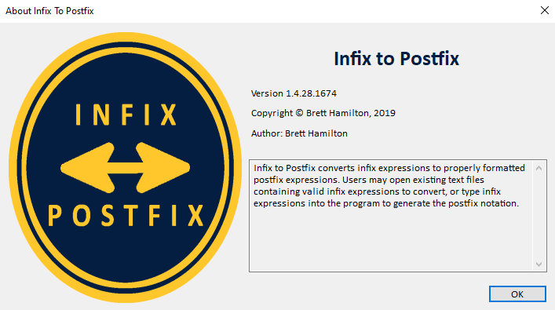
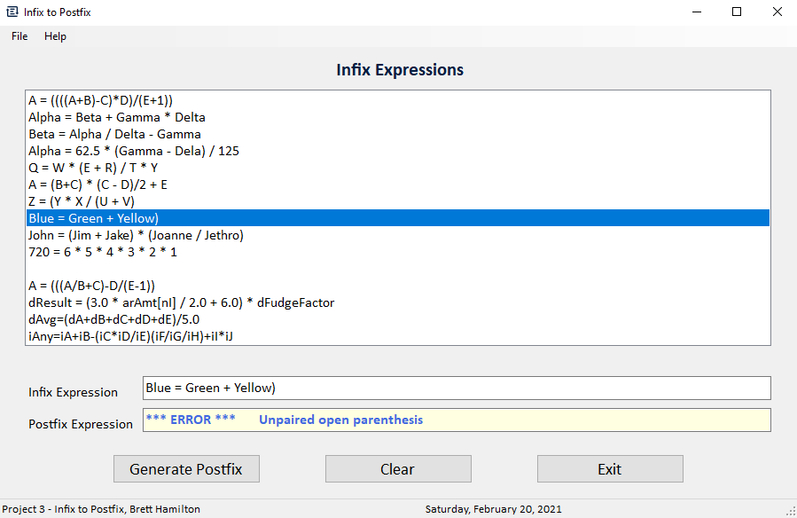

# Infix-to-Postfix Conversion Tool
Infix-to-Postfix expression conversion tool created for a Data Structures course project

## About

## Demo Images
Allows users to type in a normal infix expression and convert to postfix form. 
 
When parsing expressions, parentheses must match to determine order of operations. 

